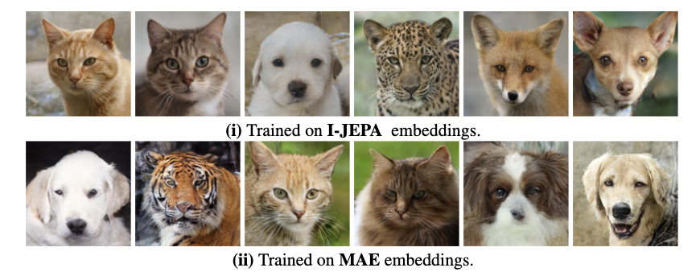

# 10708 Project

This code has been adapted from https://github.com/CompVis/latent-diffusion

**Project Title:** Does JEPA really learn high level image features ? An investigation through generative modelling



# Table of Contents

- [Quick Start](#quick-start)
- [Environment Setup](#environment-setup)
- [Datasets](#datasets)
- [Download Pretrained Encoders](#download-pretrained-encoders)
- [AFHQ Encoder Embeddings](#afhq-encoder-embeddings)
- [VAE Training](#vae-training)
- [Decoder Training](#decoder-training)
- [Diffusion Model Training](#diffusion-model-training)
- [Image Generation](#image-generation)

# Quick Start

For getting started quickly, this sections decribes how to generate images using a pretrained decoder and diffusion model. The steps are as follows:

1. Setup the python environment according to [this](#environment-setup) section
2. Download the pretrained decoder model `jepa_decoder_epoch_150.ckpt` from [here](https://drive.google.com/file/d/13eOakawexnv8EZl_cw4mHlxDyXryol9_/view?usp=drive_link) and the diffuion model trained on JEPA Embeddings `unconditional_epoch_150_jepa.ckpt` from [here](https://drive.google.com/file/d/1mYi37dMe5F94RBXdLIsOd7iAIgKz91_P/view?usp=drive_link).
3. Now run the following command to generate 100 images with 200 DDIM steps using the downloaded model:
```
python scripts/sample_diffusion.py --logdir ./ --ckpt unconditional_epoch_150_jepa.ckpt --config configs/latent-diffusion/afhq-ldm-kl-16-jepa-vae.yaml -n 100 -c 200 --decoder_path jepa_decoder_epoch_150.ckpt
```
This will save the generated images inside the directory `samples_<curr_time>/img/unconditional_epoch_150_jepa`.

# Environment Setup

To setup the environment, run the following commands

```
conda env create -f environment.yaml
conda activate ldm
pip install packaging==21.3
pip install 'torchmetrics<0.8'
```

Additionally, perform the fix from https://github.com/CompVis/latent-diffusion/issues/207#issuecomment-1502057765
```
However, I also encounter the error from torch._six import string_classes ModuleNotFoundError: No module named 'torch._six'
Doing the following step is helpful for me: (reference pytorch/pytorch#94709)
from torch._six import string_classes
-> delete this import and replace string_classes with str
```

# Datasets

The AFHQ dataset can be downloaded from Kaggle using the following command:

```
kaggle datasets download -d andrewmvd/animal-faces
```

It contains about 16k high quality images of Animal faces. Once the dataset is download, move it into the `data/afhq` directory and create two files `train.txt` and `val.txt` inside `data/afhq` containing the relative paths to the train and val images respectively.


# Download Pretrained Encoders

The IJEPA encoder can be downloaded from [here](https://github.com/facebookresearch/ijepa) and MAE can be downloaded from [here](https://github.com/facebookresearch/mae). We use the ViT-Huge variant for our experiments.

# AFHQ Encoder Embeddings

To extract and save the embeddings for the AFHQ dataset, run the following commands for train and validation images:

```
python get_embds.py jepa_weights/vit_huge_14.pth data/afhq/train.txt jepa_afhq_embeds_train.npy

python get_embds.py jepa_weights/vit_huge_14.pth data/afhq/val.txt jepa_afhq_embeds_val.npy
```
```
python get_embds.py mae_weights/vit_huge_14.pth data/afhq/train.txt mae_afhq_embeds_train.npy

python get_embds.py mae_weights/vit_huge_14.pth data/afhq/val.txt mae_afhq_embeds_val.npy
```

Assuming the `jepa_weights/vit_huge_14.pth` is the path to the saved IJEPA Encoder. The same can be run for MAE as well.

# VAE Training

To train a VAE on top of the IJEPA or MAE Encoder, run the following command:

```
python train_vae.py --train_data saved_embeds/mae_afhq_embeds_train.npy --val_data saved_embeds/jepa_afhq_embeds_val.npy --epochs 10 --learning_rate 0.01


python train_vae.py --train_data saved_embeds/mae_afhq_embeds_train.npy --val_data saved_embeds/mae_afhq_embeds_val.npy --epochs 10 --learning_rate 0.01
```


# Decoder Training

To train the decoder model on a single gpu, run the following command:

```
python main.py --base configs/autoencoder/autoencoder_kl_16x16x16_afhq_vae_jepa.yaml -t --gpus 0,
```

# Diffusion Model Training

Once the decoder model has been trained, now to finally train the diffusion model, run the following command:

```
python main.py --base configs/latent-diffusion/afhq-ldm-kl-16-jepa-vae.yaml -t --gpus 0,
```

For training a class-conditional diffusion model, run the following command:

```
python main.py --base configs/latent-diffusion/afhq-ldm-kl-15-jepa-cc.yaml -t --gpus 0,
```

# Image Generation

Once the diffusion model is trained, to sample 5000 images unconditionally with 200 DDIM steps, run the following command:

```
python scripts/sample_diffusion.py -r <path to trained model dir> --ckpt <model ckpt idx> -n 5000 -c 200
```

For e.g.
```
python scripts/sample_diffusion.py -r logs/2024-04-24T18-31-43_afhq-ldm-kl-16-jepa-vae/ --ckpt 149 -n 5000 -c 200
```

For conditional generation, run the same command with a diffusion model that has been trained for unconditional generation. It will generate 5000/3 samples from each of the three image classes of AFHQ.


# Pretrained Models

The pretrained diffusion models can be downloaded from the drive link [here](https://drive.google.com/drive/folders/1wOG17YYHDT6nyBQwIDFxNzh86ydAzbKg?usp=sharing).

